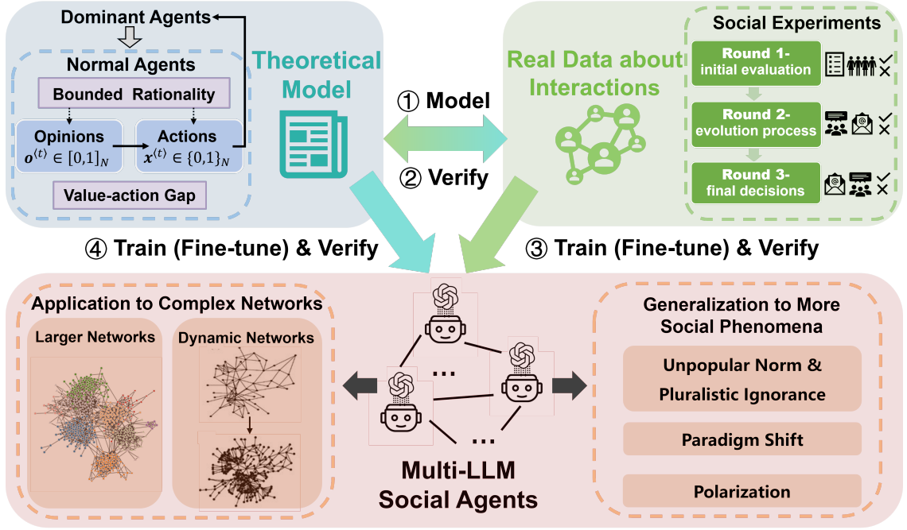

# LLM-SAM

Official repository for **The LLM-Empowered Social Agent Modeling (LLM-SAM) Framework: Simulating the Coevolution of Opinions and Actions**



Understanding and simulating inherently complex social interactions are crucial for addressing challenges in areas such as collective decision-making, marketing, policy design, and social governance. The recent emergence and development of large language models (LLMs) has led to growing works focusing on using LLMs to simulate multi-agent social interactions. However, current LLM-based social agent systems fail to fully represent human diversity and irrationality, as data used to train LLMs is limited due to privacy and security reasons. To overcome these limitations, we propose a new framework, Large Language Model-empowered Social Agent Modeling (LLM-SAM), which incorporates the theoretical models, real-user data, and LLMs to simulate complex social interactions in a more comprehensive and scalable way. Specifically, we use the coevolution of opinions and actions, a key aspect of social dynamics as an example, and apply LLM-SAM to demonstrate the feasibility and applicability of the proposed framework. The theoretical models and real-user data collected on small and static networks are used to train the social agents empowered by LLMs, and then to verify their correctness. Next, the fine-tuned multi-LLM social agents are used to simulate social interactions in more complex scenarios such as larger and dynamic networks. Our simulation results demonstrate that the proposed LLM-SAM framework can capture a range of complex social phenomena not considered in the theoretical model or not observed in real-user data, such as the emergence of the unpopular norm, paradigm shift, and polarization.

### Install

```bash
pip install openai
# Install vLLM with CUDA 12.1.
pip install vllm
```

### Experiment

#### Validation of Multi-LLM Social Agents

```bash
# including LLaMA, Qwen and GPT-4o-mini
bash run_social_agent.sh
```

#### Applications to Larger Networks

```bash
# including LLaMA, Qwen and GPT-4o-mini
bash run_large_network.sh
```

#### Applications to Dynamic Network

```bash
# including LLaMA, Qwen and GPT-4o-mini
bash run_dynamic_network.sh
```